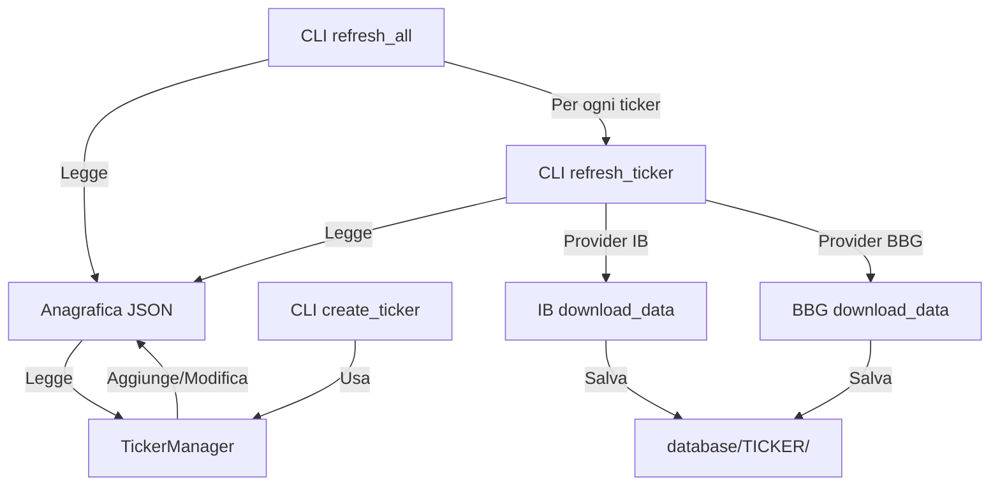

# Quanto Data Fetching System

## Flusso di Lavoro

```mermaid
graph TD
    A[Anagrafica JSON] -->|Legge| B[TickerManager]
    B -->|Aggiunge/Modifica| A
    C[CLI create_ticker] -->|Usa| B
    D[CLI refresh_ticker] -->|Legge| A
    D -->|Provider IB| E[IB download_data]
    D -->|Provider BBG| F[BBG download_data]
    E -->|Salva| G[database/TICKER/]
    F -->|Salva| G
    H[CLI refresh_all] -->|Legge| A
    H -->|Per ogni ticker| D
```
